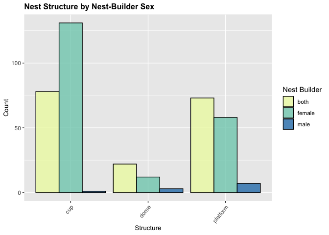
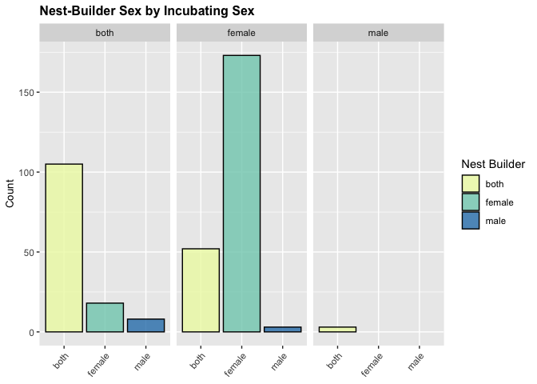
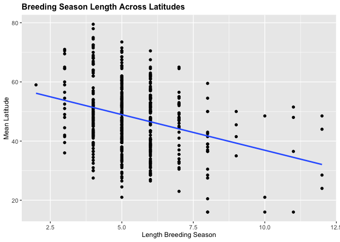
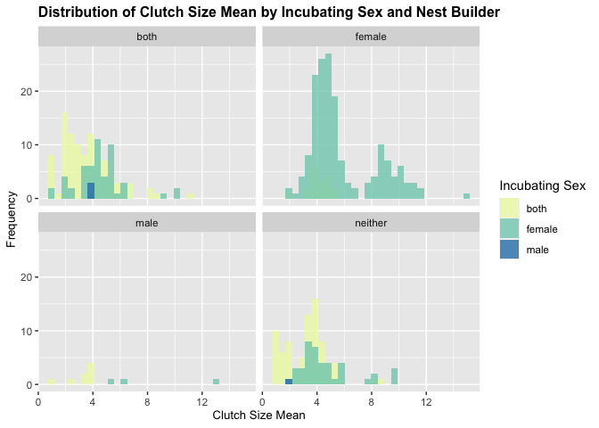
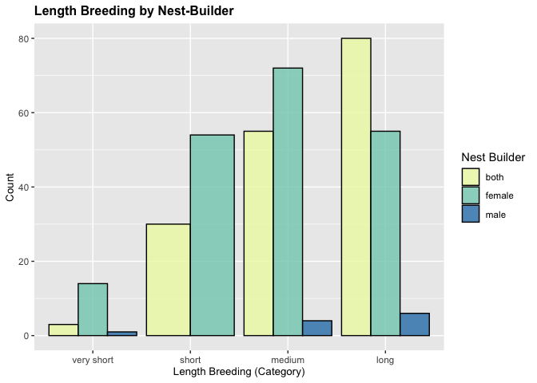
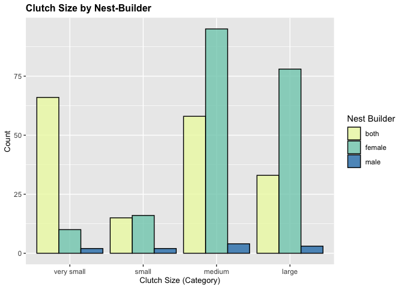

## Libraries


```r
library(tidyverse)
```

```
## ── Attaching core tidyverse packages ──────────────────────── tidyverse 2.0.0 ──
## ✔ dplyr     1.1.4     ✔ readr     2.1.5
## ✔ forcats   1.0.0     ✔ stringr   1.5.1
## ✔ ggplot2   3.4.4     ✔ tibble    3.2.1
## ✔ lubridate 1.9.3     ✔ tidyr     1.3.1
## ✔ purrr     1.0.2     
## ── Conflicts ────────────────────────────────────────── tidyverse_conflicts() ──
## ✖ dplyr::filter() masks stats::filter()
## ✖ dplyr::lag()    masks stats::lag()
## ℹ Use the conflicted package (<http://conflicted.r-lib.org/>) to force all conflicts to become errors
```

```r
library(naniar)
library(janitor)
```

```
## 
## Attaching package: 'janitor'
## 
## The following objects are masked from 'package:stats':
## 
##     chisq.test, fisher.test
```

```r
library(dplyr)
#install.packages("gtools")
library(gtools)
```

## Data


```r
dataset <- read_delim("../data/Sex_specific_contribution.csv", delim=";") %>% clean_names()
```

```
## Rows: 521 Columns: 8
## ── Column specification ────────────────────────────────────────────────────────
## Delimiter: ";"
## chr (5): Species, Nest_builder, Nest_site, Nest_structure, Incubating_sex
## dbl (3): Clutch_size_mean, Length_breeding, Latitude_mean
## 
## ℹ Use `spec()` to retrieve the full column specification for this data.
## ℹ Specify the column types or set `show_col_types = FALSE` to quiet this message.
```


**First, we look at the structure of our dataset and look for null or NA values.**


```r
glimpse(dataset)
```

```
## Rows: 521
## Columns: 8
## $ species          <chr> "Accipiter_badius", "Accipiter_brevipes", "Accipiter_…
## $ nest_builder     <chr> "female", "female", "both", "both", "neither", "both"…
## $ nest_site        <chr> "tree_bush", "tree_bush", "tree_bush", "tree_bush", "…
## $ nest_structure   <chr> "cup", "cup", "cup", "cup", "no nest", "cup", "cup", …
## $ clutch_size_mean <dbl> 3.5, 4.0, 3.5, 5.0, 4.5, 4.5, 4.5, NA, 4.5, 4.0, 5.0,…
## $ incubating_sex   <chr> "female", "female", "female", "female", "both", "fema…
## $ length_breeding  <dbl> 4, 3, 6, 5, 4, 6, 4, NA, 6, 4, 4, 5, 6, 5, 6, 6, 5, 7…
## $ latitude_mean    <dbl> NA, 44.5, 52.5, 49.0, 35.5, 46.0, 47.0, NA, 59.5, 38.…
```


```r
summary(dataset)
```

```
##    species          nest_builder        nest_site         nest_structure    
##  Length:521         Length:521         Length:521         Length:521        
##  Class :character   Class :character   Class :character   Class :character  
##  Mode  :character   Mode  :character   Mode  :character   Mode  :character  
##                                                                             
##                                                                             
##                                                                             
##                                                                             
##  clutch_size_mean incubating_sex     length_breeding  latitude_mean  
##  Min.   : 1.000   Length:521         Min.   : 2.000   Min.   :16.00  
##  1st Qu.: 3.500   Class :character   1st Qu.: 4.000   1st Qu.:38.50  
##  Median : 4.000   Mode  :character   Median : 5.000   Median :47.50  
##  Mean   : 4.511                      Mean   : 5.431   Mean   :46.99  
##  3rd Qu.: 5.500                      3rd Qu.: 6.000   3rd Qu.:54.50  
##  Max.   :15.000                      Max.   :12.000   Max.   :79.50  
##  NA's   :8                           NA's   :20       NA's   :8
```


```r
miss_var_summary(dataset)
```

```
## # A tibble: 8 × 3
##   variable         n_miss pct_miss
##   <chr>             <int>    <dbl>
## 1 incubating_sex       32     6.14
## 2 length_breeding      20     3.84
## 3 clutch_size_mean      8     1.54
## 4 latitude_mean         8     1.54
## 5 species               0     0   
## 6 nest_builder          0     0   
## 7 nest_site             0     0   
## 8 nest_structure        0     0
```

There appear to be NAs, but are all accurately represented as NAs. 

## Nest building

#### 1. We want to understand the distribution of sexes. 


```r
dataset %>% 
  ggplot(aes(x=nest_builder, fill=nest_builder)) + 
  geom_bar(color="black", alpha=0.8) + 
  theme(legend.position = "none",
        axis.text.x = element_text(angle=50, hjust=1),
        plot.title = element_text(size=12, face="bold"),
        axis.title.x = element_text(size=10),
        axis.title.y = element_text(size=10)) +
  labs(title="Distribution of Nest-Builder Sex",
       x="Nest Builder", 
       y="Count") + 
  scale_fill_brewer(palette="YlGnBu")
```

<!-- -->

We see that the most common nest builder is female, followed by both parents, then neither, and the least common (which is very uncommon) is a male nest builder. Since the 'neither' category won't tell us much about patterns for nest building, we can filter it from further analysis. This 'neither' class definitely represents interesting breeding behavior, however.

Who are the male nest builders?

```r
dataset %>% 
  select(species, nest_builder) %>% 
  filter(nest_builder == "male")
```

```
## # A tibble: 11 × 2
##    species                 nest_builder
##    <chr>                   <chr>       
##  1 Alectoris_rufa          male        
##  2 Lagonosticta_senegala   male        
##  3 Limicola_falcinellus    male        
##  4 Limosa_limosa           male        
##  5 Numenius_arquata        male        
##  6 Oceanodroma_leucorhoa   male        
##  7 Ploceus_manyar          male        
##  8 Sturnus_vulgaris        male        
##  9 Tringa_nebularia        male        
## 10 Troglodytes_troglodytes male        
## 11 Vanellus_spinosus       male
```

#### 2. Do other factors have correlations with the sex of the nest builder?

The paper in which we found the data gives some interesting predictions for nest-building based on other variables in the data. In the paper, they explore these predictions with robust statistical analysis. We want to see if any of these predictions can be observed in our plots.

**Nest-Builder vs. Nest Site**
Let's look at how nest site and nest builder correlate.
We predict that above ground nests (tree, ledge, wall) are more likely to be built by both parents, since reduced accessibility/convenience of these nest locations may require the combined effort, energy, and investment of both parents.


```r
dataset %>%
  filter(nest_builder != "neither") %>% 
  ggplot(aes(x=nest_builder, fill=nest_builder)) + 
  geom_bar(color="black", alpha=0.8) +
  theme(axis.text.x = element_text(angle=50, hjust=1),
        plot.title = element_text(size=12, face="bold"),
        axis.title.x = element_text(size=10),
        axis.title.y = element_text(size=10)) +
  labs(title="Nest-Builder Sex by Site",
       x="Nest Builder", 
       y="Count",
       fill="Nest Builder") + 
  facet_wrap(~nest_site) + 
  scale_fill_brewer(palette="YlGnBu")
```

<!-- -->

We see that females tend to take the lead in ground and grass reed nest building. Both parents tend to be more involved in ground holes, ledges, tree bushes, walls, and water. Thus, the prediction seems to hold in most instances of above-ground nest-building. 

Here's another way of visualizing similar info:


```r
dataset %>% 
  filter(nest_builder != "neither") %>% 
  ggplot(aes(x=nest_site, fill=nest_builder)) +
  geom_bar(position = "dodge", color="black", alpha=0.8) +
  theme(axis.text.x = element_text(angle=50, hjust=1),
        plot.title = element_text(size=12, face="bold"),
        axis.title.x = element_text(size=10),
        axis.title.y = element_text(size=10)) +
  labs(title="Nest Site by Nest-Builder Sex",
       x="Site", 
       y="Count",
       fill="Nest Builder") +
  scale_fill_brewer(palette="YlGnBu")
```

<!-- -->

**Nest-builder vs. Nest Structure**
We'll also take a look at how nest structure and nest builder correlate. We predict nests with more complex structures (i.e., domed), are more likely to be built by both parents. Combined cognitive efforts/abilities = more complex nests.


```r
dataset %>% 
  filter(nest_builder != "neither") %>% 
  ggplot(aes(x=nest_builder, fill=nest_builder)) + 
  geom_bar(color="black", alpha=0.8) +
  theme(axis.text.x = element_text(angle=50, hjust=1),
        plot.title = element_text(size=12, face="bold"),
        axis.title.x = element_text(size=10),
        axis.title.y = element_text(size=10)) +
  labs(title="Nest-Builder Sex by Nest Structure",
       x=NULL, 
       y="Count",
       fill="Nest Builder") + 
  facet_wrap(~nest_structure) + 
  scale_fill_brewer(palette="YlGnBu")
```

<!-- -->

This prediction generally holds, since in species that build domed nests, the majority have both parents nest-building.

Alternatively:


```r
dataset %>% 
  filter(nest_builder != "neither") %>% 
  ggplot(aes(x=nest_structure, fill=nest_builder)) +
  geom_bar(position = "dodge", color="black", alpha=0.8) +
  theme(axis.text.x = element_text(angle=50, hjust=1),
        plot.title = element_text(size=12, face="bold"),
        axis.title.x = element_text(size=10),
        axis.title.y = element_text(size=10)) +
  labs(title="Nest Structure by Nest-Builder Sex",
       x="Structure", 
       y="Count",
       fill="Nest Builder") +
  scale_fill_brewer(palette="YlGnBu")
```

<!-- -->


**Nest-Builder vs. Incubating Sex**
What about the correlation between the incubating sex and nest-building sex? When the female parent is the incubator, we expect the male parent to be the nest-builder. We expect for there to be a 'trade-off' for the large reproductive effort of the female parent, with the male parent building the nest to offload the reproductive burden.


```r
dataset %>% 
  filter(nest_builder != "neither") %>% 
  filter(incubating_sex != "NA") %>% 
  ggplot(aes(x=nest_builder, fill=nest_builder)) + 
  geom_bar(color="black", alpha=0.8) +
  theme(axis.text.x = element_text(angle=50, hjust=1),
        plot.title = element_text(size=12, face="bold"),
        axis.title.x = element_text(size=10),
        axis.title.y = element_text(size=10)) +
  labs(title="Nest-Builder Sex by Incubating Sex",
       x=NULL, 
       y="Count",
       fill="Nest Builder") + 
  facet_wrap(~incubating_sex) + 
  scale_fill_brewer(palette="YlGnBu")
```

<!-- -->

Surprisingly, when the female parent incubates, she also tends to be the nest-builder. Perhaps the female is more invested in nest-building since she'll be spending a lot of time there incubating the eggs; thus, the quality and integrity of the nest directly impacts her fitness.

Same concept, different plot:


```r
dataset %>% 
  filter(nest_builder != "neither") %>% 
  filter(incubating_sex != "NA") %>% 
  ggplot(aes(x=incubating_sex, fill=nest_builder)) +
  geom_bar(position = "dodge", color="black", alpha=0.8) +
  theme(axis.text.x = element_text(angle=50, hjust=1),
        plot.title = element_text(size=12, face="bold"),
        axis.title.x = element_text(size=10),
        axis.title.y = element_text(size=10)) +
  labs(title="Incubating Sex by Nest-Builder Sex",
       x="Incubating Sex", 
       y="Count",
       fill="Nest Builder") +
  scale_fill_brewer(palette="YlGnBu")
```

<!-- -->

#### 3. How does the sex of the nest builder correlate with our continuous variables?

**Nest-builder vs. Mean Clutch Size**
We expect the average clutch size to be larger in species with male-nest builders. Again, this would serve as a reproductive trade-off that balances the relative effort of each parent.


```r
dataset %>% 
  filter(nest_builder != "neither") %>%
  filter(clutch_size_mean != "NA") %>% 
  ggplot(aes(x=nest_builder, y=clutch_size_mean, 
             fill=nest_builder)) +
  geom_boxplot(alpha=0.8) +
  theme(plot.title = element_text(size=12, face="bold"),
        axis.title.x = element_text(size=10),
        axis.title.y = element_text(size=10)) +
  labs(title="Mean Clutch Size by Builder Sex",
       x=NULL, 
       y="Mean Clutch Size",
       fill="Nest Builder") +
  scale_fill_brewer(palette="YlGnBu")
```

<!-- -->

The average clutch size tends to be largest when the female parent is the nest-builder, contrary to the prediction. Again, maybe the parent laying the eggs has more direct concern for nest integrity, especially when there are more eggs in a brood.

**Nest-builder vs. Length Breeding Season**
We expect the breeding season to be shortest in species where both parents build the nest. This is because the combined nest-building efforts of both parents can help species overcome the time limitations within a short breeding season.


```r
dataset %>% 
  filter(nest_builder != "neither") %>%
  filter(length_breeding != "NA") %>% 
  ggplot(aes(x=nest_builder, y=length_breeding, 
             fill=nest_builder)) +
  geom_boxplot(alpha=0.8) +
  theme(plot.title = element_text(size=12, face="bold"),
        axis.title.x = element_text(size=10),
        axis.title.y = element_text(size=10)) +
  labs(title="Length of Breeding Season by Builder Sex",
       x=NULL, 
       y="Length of Breeding Season (months)",
       fill="Nest Builder") +
  scale_fill_brewer(palette="YlGnBu")
```

<!-- -->

We actually see that the breeding season leans to the short-size not when both parents build the nest, but when the female parent builds the nest. Perhaps within a short breeding season, species deal with the time limitations by performing sex-specific task specialization. For example, in many species with short breeding seasons, the female parent builds the nest, while the male parent defends the territory.

**Nest-builder vs. Mean Breeding Latitude**
We the mean breeding latitude to be higher when both parents build the nest. At higher latitudes, there is more seasonally available food, there may be increased opportunities for both parents to collect materials required for nest-building.


```r
dataset %>% 
  filter(nest_builder != "neither") %>%
  filter(latitude_mean != "NA") %>% 
  ggplot(aes(x=nest_builder, y=latitude_mean, 
             fill=nest_builder)) +
  geom_boxplot(alpha=0.8) +
  theme(plot.title = element_text(size=12, face="bold"),
        axis.title.x = element_text(size=10),
        axis.title.y = element_text(size=10)) +
  labs(title="Breeding Latitude by Builder Sex",
       x=NULL, 
       y="Mean Breeding Latitude",
       fill="Nest Builder") +
  scale_fill_brewer(palette="YlGnBu")
```

<!-- -->

We end up seeing higher breeding latitudes in species with uni-parental nest-building (female only or male only); the breeding latitude tends to be lower when both parents build the nest. Perhaps this has to do with the negative correlation between breeding latitude and length of the breeding season (see plot in 'More Exploration'); birds that breed at high latitudes tend to have short breeding seasons, and we see shorter breeding seasons when the female parent is the nest builder. This, however, wouldn't explain why we see higher breeding latitudes when the male-parent is the nest builder.

## More Exploration


```r
na.omit(dataset) %>%
ggplot(aes(x = latitude_mean, y = clutch_size_mean)) +
  geom_density_2d() +
  labs(title="Mean Latitude vs. Mean Clutch Size",
       x="Mean Latitude",
       y="Mean Clutch Size") +
  theme(plot.title = element_text(size=12, face="bold"),
        axis.title.x = element_text(size=10),
        axis.title.y = element_text(size=10))
```

<!-- -->


```r
na.omit(dataset) %>%
  ggplot(aes(x=latitude_mean, y=clutch_size_mean)) +
  geom_point() +
  geom_smooth(method = "lm", se = FALSE, color="red") + 
  labs(x="Mean Latitude", 
       y="Mean Clutch Size", 
       title="Clutch Size vs. Latitude") +
  theme(plot.title = element_text(size=12, face="bold"),
        axis.title.x = element_text(size=10),
        axis.title.y = element_text(size=10))
```

```
## `geom_smooth()` using formula = 'y ~ x'
```

<!-- -->


```r
na.omit(dataset) %>%
  filter(nest_builder != "neither") %>%
  ggplot(aes(x = latitude_mean, y = clutch_size_mean, color = nest_structure)) +
  geom_point() +
  geom_smooth(method = "lm", se = FALSE, aes(group = nest_structure)) + # Grouping for separate regression lines
  labs(x="Latitude Mean", 
       y="Mean Clutch Size", 
       title="Clutch Size vs. Latitude by Nest Structure") +
  theme(plot.title = element_text(size=12, face="bold"),
        axis.title.x = element_text(size=10),
        axis.title.y = element_text(size=10)) +
  scale_color_brewer(palette = "YlGnBu")
```

```
## `geom_smooth()` using formula = 'y ~ x'
```

<!-- -->


```r
na.omit(dataset) %>%
  ggplot(aes(x=length_breeding, y=latitude_mean)) +
  geom_point() +
  geom_smooth(method="lm", se=F) +
  labs(title="Breeding Season Length Across Latitudes",
       x="Length Breeding Season",
       y="Mean Latitude") +
  theme(plot.title = element_text(size=12, face="bold"),
        axis.title.x = element_text(size=10),
        axis.title.y = element_text(size=10))
```

```
## `geom_smooth()` using formula = 'y ~ x'
```

<!-- -->


```r
na.omit(dataset) %>%
  ggplot(aes(x = latitude_mean, y = length_breeding)) +
  geom_point() +  
  geom_smooth(method = "loess", color = "blue") +  
  labs(title="Breeding Season Length Across Latitudes",
       x="Mean Latitude",
       y="Length Breeding Season") +
  theme(plot.title = element_text(size=12, face="bold"),
        axis.title.x = element_text(size=10),
        axis.title.y = element_text(size=10))
```

```
## `geom_smooth()` using formula = 'y ~ x'
```

<!-- -->


```r
na.omit(dataset) %>%
  filter(nest_builder != "neither") %>%
  ggplot( aes(x = nest_structure)) +
  geom_bar(aes(fill = nest_structure), show.legend = FALSE,
           color="black", alpha=0.8) +
  labs(title ="Nest Structure Distribution", 
       x="Nest Structure", 
       y="Count") +
  theme(plot.title = element_text(size=12, face="bold"),
        axis.title.x = element_text(size=10),
        axis.title.y = element_text(size=10)) +
  scale_fill_brewer(palette="YlGnBu")
```

<!-- -->


```r
na.omit(dataset) %>%
 ggplot(aes(x = clutch_size_mean)) +
  geom_histogram(aes(fill = incubating_sex), bins = 30, 
                 alpha = 0.8, position = "identity") +
  facet_wrap(~nest_builder) +
  labs(title="Distribution of Clutch Size Mean by Incubating Sex and Nest Builder",
       x = "Clutch Size Mean",
       y = "Frequency",
       fill="Incubating Sex") +
  theme(plot.title = element_text(size=12, face="bold"),
        axis.title.x = element_text(size=10),
        axis.title.y = element_text(size=10)) +
  scale_fill_brewer(palette = "YlGnBu")
```

<!-- -->

## `case_when()` with our Continuous Variables

Another way of exploring the data is using case_when() to make new variables based on our findings. 
Essentially, here we use the range of each continuous variable to create categories; how each category is defined is relative to all observations under that variable. While these plots help us better interpret some of our predictions (i.e., which parent is most often the nest-builder when breeding seasons are short?), they should be used with caution. Given the small number of male nest-builders in the data, it will be difficult to observe their presence/impact to each category (it will be 'drowned out' by other observations in the data).

**Length Breeding Season:** 


```r
len_quartiles <- quantcut(dataset$length_breeding)
table(len_quartiles)
```

```
## len_quartiles
##  [2,4]  (4,5]  (5,6] (6,12] 
##    126    170    126     79
```


```r
dataset %>% 
  mutate(cat_len=case_when(length_breeding<4 ~ "very short",
                           length_breeding>=4 & length_breeding<5 ~ "short",
                           length_breeding>=5 & length_breeding<6 ~ "medium",
                           length_breeding>=6 ~ "long")) %>% 
  select(species, length_breeding, cat_len) %>% 
  head()
```

```
## # A tibble: 6 × 3
##   species               length_breeding cat_len   
##   <chr>                           <dbl> <chr>     
## 1 Accipiter_badius                    4 short     
## 2 Accipiter_brevipes                  3 very short
## 3 Accipiter_gentilis                  6 long      
## 4 Accipiter_nisus                     5 medium    
## 5 Acridotheres_tristis                4 short     
## 6 Acrocephalus_agricola               6 long
```


```r
dataset %>% 
  mutate(cat_len=case_when(length_breeding<4 ~ "very short",
                           length_breeding>=4 & length_breeding<5 ~ "short",
                           length_breeding>=5 & length_breeding<6 ~ "medium",
                           length_breeding>=6 ~ "long")) %>% 
  filter(cat_len != "NA") %>% 
  filter(nest_builder != "neither") %>% 
  ggplot(aes(x=factor(cat_len, level=c("very short", "short", "medium", "long")), 
             fill=nest_builder)) +
  geom_bar(position = "dodge", color="black", alpha=0.8) +
  labs(title="Length Breeding by Nest-Builder",
       x = "Length Breeding (Category)",
       y = "Count",
       fill="Nest Builder") +
  theme(plot.title = element_text(size=12, face="bold"),
        axis.title.x = element_text(size=10),
        axis.title.y = element_text(size=10)) +
  scale_fill_brewer(palette = "YlGnBu")
```

<!-- -->

**Mean Clutch Size:**


```r
clutch_quartiles <- quantcut(dataset$clutch_size_mean)
table(clutch_quartiles)
```

```
## clutch_quartiles
##  [1,3.5]  (3.5,4]  (4,5.5] (5.5,15] 
##      182       81      159       91
```


```r
dataset %>% 
  mutate(cat_clutch=case_when(clutch_size_mean<3.5 ~ "very small",
                           clutch_size_mean>=3.5 & clutch_size_mean<4 ~ "small",
                           clutch_size_mean>=4 & clutch_size_mean<5.5 ~ "medium",
                           clutch_size_mean>=5.5 ~ "large")) %>% 
  select(species, clutch_size_mean, cat_clutch) %>% 
  head()
```

```
## # A tibble: 6 × 3
##   species               clutch_size_mean cat_clutch
##   <chr>                            <dbl> <chr>     
## 1 Accipiter_badius                   3.5 small     
## 2 Accipiter_brevipes                 4   medium    
## 3 Accipiter_gentilis                 3.5 small     
## 4 Accipiter_nisus                    5   medium    
## 5 Acridotheres_tristis               4.5 medium    
## 6 Acrocephalus_agricola              4.5 medium
```


```r
dataset %>% 
  mutate(cat_clutch=case_when(clutch_size_mean<3.5 ~ "very small",
                           clutch_size_mean>=3.5 & clutch_size_mean<4 ~ "small",
                           clutch_size_mean>=4 & clutch_size_mean<5.5 ~ "medium",
                           clutch_size_mean>=5.5 ~ "large")) %>% 
  filter(cat_clutch != "NA") %>% 
  filter(nest_builder != "neither") %>% 
  ggplot(aes(x=factor(cat_clutch, level=c("very small", "small", "medium", "large")), 
             fill=nest_builder)) +
  geom_bar(position = "dodge", color="black", alpha=0.8) +
  labs(title="Clutch Size by Nest-Builder",
       x = "Clutch Size (Category)",
       y = "Count",
       fill="Nest Builder") +
  theme(plot.title = element_text(size=12, face="bold"),
        axis.title.x = element_text(size=10),
        axis.title.y = element_text(size=10)) +
  scale_fill_brewer(palette = "YlGnBu")
```

<!-- -->

**Mean Breeding Latitude**


```r
lat_quartiles <- quantcut(dataset$latitude_mean)
table(lat_quartiles)
```

```
## lat_quartiles
##   [16,38.5] (38.5,47.5] (47.5,54.5] (54.5,79.5] 
##         129         136         129         119
```


```r
dataset %>% 
  mutate(cat_lat=case_when(latitude_mean<38.5 ~ "very low",
                           latitude_mean>=38.5 & latitude_mean<47.5 ~ "low",
                           latitude_mean>=47.5 & latitude_mean<54.5 ~ "medium",
                           latitude_mean>=54.5 ~ "high")) %>% 
  select(species, latitude_mean, cat_lat) %>% 
  head()
```

```
## # A tibble: 6 × 3
##   species               latitude_mean cat_lat 
##   <chr>                         <dbl> <chr>   
## 1 Accipiter_badius               NA   <NA>    
## 2 Accipiter_brevipes             44.5 low     
## 3 Accipiter_gentilis             52.5 medium  
## 4 Accipiter_nisus                49   medium  
## 5 Acridotheres_tristis           35.5 very low
## 6 Acrocephalus_agricola          46   low
```


```r
dataset %>% 
  mutate(cat_lat=case_when(latitude_mean<38.5 ~ "very low",
                           latitude_mean>=38.5 & latitude_mean<47.5 ~ "low",
                           latitude_mean>=47.5 & latitude_mean<54.5 ~ "medium",
                           latitude_mean>=54.5 ~ "high")) %>% 
  filter(cat_lat != "NA") %>% 
  filter(nest_builder != "neither") %>% 
  ggplot(aes(x=factor(cat_lat, level=c("very low", "low", "medium", "high")),
             fill=nest_builder)) +
  geom_bar(position = "dodge", color="black", alpha=0.8) +
  labs(title="Breeding Latitude by Nest-Builder",
       x = "Breeding Latitude (Category)",
       y = "Count",
       fill="Nest Builder") +
  theme(plot.title = element_text(size=12, face="bold"),
        axis.title.x = element_text(size=10),
        axis.title.y = element_text(size=10)) +
  scale_fill_brewer(palette = "YlGnBu")
```

<!-- -->

