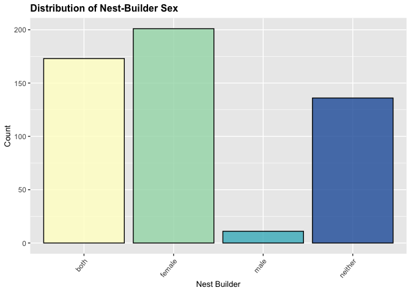
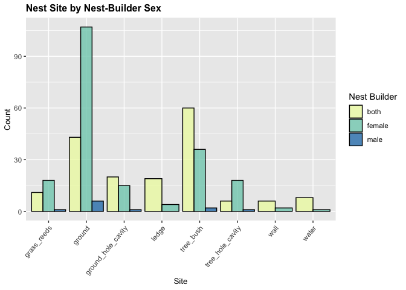
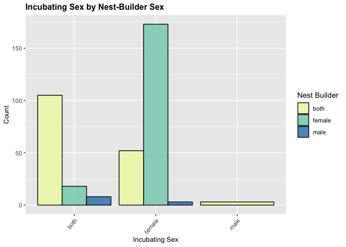

## Libraries


```r
library(tidyverse)
```

```
## ── Attaching core tidyverse packages ──────────────────────── tidyverse 2.0.0 ──
## ✔ dplyr     1.1.4     ✔ readr     2.1.5
## ✔ forcats   1.0.0     ✔ stringr   1.5.1
## ✔ ggplot2   3.4.4     ✔ tibble    3.2.1
## ✔ lubridate 1.9.3     ✔ tidyr     1.3.1
## ✔ purrr     1.0.2     
## ── Conflicts ────────────────────────────────────────── tidyverse_conflicts() ──
## ✖ dplyr::filter() masks stats::filter()
## ✖ dplyr::lag()    masks stats::lag()
## ℹ Use the conflicted package (<http://conflicted.r-lib.org/>) to force all conflicts to become errors
```

```r
library(naniar)
library(janitor)
```

```
## 
## Attaching package: 'janitor'
## 
## The following objects are masked from 'package:stats':
## 
##     chisq.test, fisher.test
```

## Data


```r
dataset <- read_delim("../data/Sex_specific_contribution.csv", delim=";") %>% clean_names()
```

```
## Rows: 521 Columns: 8
## ── Column specification ────────────────────────────────────────────────────────
## Delimiter: ";"
## chr (5): Species, Nest_builder, Nest_site, Nest_structure, Incubating_sex
## dbl (3): Clutch_size_mean, Length_breeding, Latitude_mean
## 
## ℹ Use `spec()` to retrieve the full column specification for this data.
## ℹ Specify the column types or set `show_col_types = FALSE` to quiet this message.
```


**First, we look at the structure of our dataset and look for null or NA values.**


```r
glimpse(dataset)
```

```
## Rows: 521
## Columns: 8
## $ species          <chr> "Accipiter_badius", "Accipiter_brevipes", "Accipiter_…
## $ nest_builder     <chr> "female", "female", "both", "both", "neither", "both"…
## $ nest_site        <chr> "tree_bush", "tree_bush", "tree_bush", "tree_bush", "…
## $ nest_structure   <chr> "cup", "cup", "cup", "cup", "no nest", "cup", "cup", …
## $ clutch_size_mean <dbl> 3.5, 4.0, 3.5, 5.0, 4.5, 4.5, 4.5, NA, 4.5, 4.0, 5.0,…
## $ incubating_sex   <chr> "female", "female", "female", "female", "both", "fema…
## $ length_breeding  <dbl> 4, 3, 6, 5, 4, 6, 4, NA, 6, 4, 4, 5, 6, 5, 6, 6, 5, 7…
## $ latitude_mean    <dbl> NA, 44.5, 52.5, 49.0, 35.5, 46.0, 47.0, NA, 59.5, 38.…
```


```r
summary(dataset)
```

```
##    species          nest_builder        nest_site         nest_structure    
##  Length:521         Length:521         Length:521         Length:521        
##  Class :character   Class :character   Class :character   Class :character  
##  Mode  :character   Mode  :character   Mode  :character   Mode  :character  
##                                                                             
##                                                                             
##                                                                             
##                                                                             
##  clutch_size_mean incubating_sex     length_breeding  latitude_mean  
##  Min.   : 1.000   Length:521         Min.   : 2.000   Min.   :16.00  
##  1st Qu.: 3.500   Class :character   1st Qu.: 4.000   1st Qu.:38.50  
##  Median : 4.000   Mode  :character   Median : 5.000   Median :47.50  
##  Mean   : 4.511                      Mean   : 5.431   Mean   :46.99  
##  3rd Qu.: 5.500                      3rd Qu.: 6.000   3rd Qu.:54.50  
##  Max.   :15.000                      Max.   :12.000   Max.   :79.50  
##  NA's   :8                           NA's   :20       NA's   :8
```


```r
miss_var_summary(dataset)
```

```
## # A tibble: 8 × 3
##   variable         n_miss pct_miss
##   <chr>             <int>    <dbl>
## 1 incubating_sex       32     6.14
## 2 length_breeding      20     3.84
## 3 clutch_size_mean      8     1.54
## 4 latitude_mean         8     1.54
## 5 species               0     0   
## 6 nest_builder          0     0   
## 7 nest_site             0     0   
## 8 nest_structure        0     0
```

There appear to be NAs, but are all accurately represented as NAs. 

## Nest building

**1. We want to understand the distribution of sexes.** 


```r
dataset %>% 
  ggplot(aes(x=nest_builder, fill=nest_builder)) + 
  geom_bar(color="black", alpha=0.8) + 
  theme(legend.position = "none",
        axis.text.x = element_text(angle=50, hjust=1),
        plot.title = element_text(size=12, face="bold"),
        axis.title.x = element_text(size=10),
        axis.title.y = element_text(size=10)) +
  labs(title="Distribution of Nest Builder Sex",
       x="Nest Builder", 
       y="Count",
       fill="Nest_builder") + 
  scale_fill_brewer(palette="BrBG")
```

<!-- -->

We see that the most common nest builder is female, followed by both parents, then neither, and the least common (which is very uncommon) is a male nest builder. Since the 'neither' category won't tell us much about patterns for nest building, we can filter it from further analysis.

Who are the male nest builders?

```r
dataset %>% 
  select(species, nest_builder) %>% 
  filter(nest_builder == "male")
```

```
## # A tibble: 11 × 2
##    species                 nest_builder
##    <chr>                   <chr>       
##  1 Alectoris_rufa          male        
##  2 Lagonosticta_senegala   male        
##  3 Limicola_falcinellus    male        
##  4 Limosa_limosa           male        
##  5 Numenius_arquata        male        
##  6 Oceanodroma_leucorhoa   male        
##  7 Ploceus_manyar          male        
##  8 Sturnus_vulgaris        male        
##  9 Tringa_nebularia        male        
## 10 Troglodytes_troglodytes male        
## 11 Vanellus_spinosus       male
```

**2. Do other factors have correlations with the sex of the nest builder?**

Let's look at how nest site and nest builder correlate.


```r
dataset %>%
  filter(nest_builder != "neither") %>% 
  ggplot(aes(x=nest_builder, fill=nest_builder)) + 
  geom_bar(color="black", alpha=0.8) +
  theme(axis.text.x = element_text(angle=50, hjust=1),
        plot.title = element_text(size=12, face="bold"),
        axis.title.x = element_text(size=10),
        axis.title.y = element_text(size=10)) +
  labs(title="Nest Builder Sex by Site",
       x="Nest Builder", 
       y="Count",
       fill="Nest Builder") + 
  facet_wrap(~nest_site) + 
  scale_fill_brewer(palette="BrBG")
```

<!-- -->

We see that females tend to take the lead in ground and grass reed nest building. Both parents tend to be more involved in ground holes, ledges, tree bushes, walls, and water, while neither may do work in tree holes. 

Here's another way of visualizing the same info:


```r
dataset %>% 
  filter(nest_builder != "neither") %>% 
  ggplot(aes(x=nest_site, fill=nest_builder)) +
  geom_bar(position = "dodge", color="black", alpha=0.8) +
  theme(axis.text.x = element_text(angle=50, hjust=1),
        plot.title = element_text(size=12, face="bold"),
        axis.title.x = element_text(size=10),
        axis.title.y = element_text(size=10)) +
  labs(title="Nest Site by Sex of Builder",
       x="Site", 
       y="Count",
       fill="Nest Builder") +
  scale_fill_brewer(palette="BrBG")
```

<!-- -->

We'll also take a look at how nest structure and nest builder correlate.


```r
dataset %>% 
  filter(nest_builder != "neither") %>% 
  ggplot(aes(x=nest_builder, fill=nest_builder)) + 
  geom_bar(color="black", alpha=0.8) +
  theme(axis.text.x = element_text(angle=50, hjust=1),
        plot.title = element_text(size=12, face="bold"),
        axis.title.x = element_text(size=10),
        axis.title.y = element_text(size=10)) +
  labs(title="Nest Builder Sex by Nest Structure",
       x=NULL, 
       y="Count",
       fill="Nest Builder") + 
  facet_wrap(~nest_structure) + 
  scale_fill_brewer(palette="BrBG")
```

<!-- -->

Alternatively:

```r
dataset %>% 
  filter(nest_builder != "neither") %>% 
  ggplot(aes(x=nest_structure, fill=nest_builder)) +
  geom_bar(position = "dodge", color="black", alpha=0.8) +
  theme(axis.text.x = element_text(angle=50, hjust=1),
        plot.title = element_text(size=12, face="bold"),
        axis.title.x = element_text(size=10),
        axis.title.y = element_text(size=10)) +
  labs(title="Nest Structure by Builder Sex",
       x="Structure", 
       y="Count",
       fill="Nest Builder") +
  scale_fill_brewer(palette="BrBG")
```

<!-- -->


What about the correlation between the incubating sex and nest-building sex?


```r
dataset %>% 
  filter(nest_builder != "neither") %>% 
  filter(incubating_sex != "NA") %>% 
  ggplot(aes(x=nest_builder, fill=nest_builder)) + 
  geom_bar(color="black", alpha=0.8) +
  theme(axis.text.x = element_text(angle=50, hjust=1),
        plot.title = element_text(size=12, face="bold"),
        axis.title.x = element_text(size=10),
        axis.title.y = element_text(size=10)) +
  labs(title="Nest Builder Sex by Incubating Sex",
       x=NULL, 
       y="Count",
       fill="Nest Builder") + 
  facet_wrap(~incubating_sex) + 
  scale_fill_brewer(palette="BrBG")
```

<!-- -->

Same concept, different plot:


```r
dataset %>% 
  filter(nest_builder != "neither") %>% 
  filter(incubating_sex != "NA") %>% 
  ggplot(aes(x=incubating_sex, fill=nest_builder)) +
  geom_bar(position = "dodge", color="black", alpha=0.8) +
  theme(axis.text.x = element_text(angle=50, hjust=1),
        plot.title = element_text(size=12, face="bold"),
        axis.title.x = element_text(size=10),
        axis.title.y = element_text(size=10)) +
  labs(title="Incubating Sex by Sex of Nest-builder",
       x="Incubating Sex", 
       y="Count",
       fill="Nest Builder") +
  scale_fill_brewer(palette="BrBG")
```

<!-- -->

**3. How does the sex of the nest builder correlate with our continuous variables?**

Nest builder and mean clutch size:


```r
dataset %>% 
  filter(nest_builder != "neither") %>%
  filter(clutch_size_mean != "NA") %>% 
  ggplot(aes(x=nest_builder, y=clutch_size_mean, 
             fill=nest_builder)) +
  geom_boxplot(alpha=0.8) +
  theme(plot.title = element_text(size=12, face="bold"),
        axis.title.x = element_text(size=10),
        axis.title.y = element_text(size=10)) +
  labs(title="Mean Clutch Size by Builder Sex",
       x=NULL, 
       y="Mean Clutch Size",
       fill="Nest Builder") +
  scale_fill_brewer(palette="BrBG")
```

<!-- -->


Nest builder vs. length breeding season


```r
dataset %>% 
  filter(nest_builder != "neither") %>%
  filter(length_breeding != "NA") %>% 
  ggplot(aes(x=nest_builder, y=length_breeding, 
             fill=nest_builder)) +
  geom_boxplot(alpha=0.8) +
  theme(plot.title = element_text(size=12, face="bold"),
        axis.title.x = element_text(size=10),
        axis.title.y = element_text(size=10)) +
  labs(title="Length of Breeding Season by Builder Sex",
       x=NULL, 
       y="Length of Breeding Season (months)",
       fill="Nest Builder") +
  scale_fill_brewer(palette="BrBG")
```

<!-- -->

Nest builder vs. mean breeding latitude


```r
dataset %>% 
  filter(nest_builder != "neither") %>%
  filter(latitude_mean != "NA") %>% 
  ggplot(aes(x=nest_builder, y=latitude_mean, 
             fill=nest_builder)) +
  geom_boxplot(alpha=0.8) +
  theme(plot.title = element_text(size=12, face="bold"),
        axis.title.x = element_text(size=10),
        axis.title.y = element_text(size=10)) +
  labs(title="Breeding Latitude by Builder Sex",
       x=NULL, 
       y="Mean Breeding Latitude",
       fill="Nest Builder") +
  scale_fill_brewer(palette="BrBG")
```

<!-- -->
