```r
library(tidyverse)
```

```
## ── Attaching core tidyverse packages ──────────────────────── tidyverse 2.0.0 ──
## ✔ dplyr     1.1.4     ✔ readr     2.1.4
## ✔ forcats   1.0.0     ✔ stringr   1.5.1
## ✔ ggplot2   3.4.4     ✔ tibble    3.2.1
## ✔ lubridate 1.9.3     ✔ tidyr     1.3.0
## ✔ purrr     1.0.2     
## ── Conflicts ────────────────────────────────────────── tidyverse_conflicts() ──
## ✖ dplyr::filter() masks stats::filter()
## ✖ dplyr::lag()    masks stats::lag()
## ℹ Use the conflicted package (<http://conflicted.r-lib.org/>) to force all conflicts to become errors
```

```r
library(naniar)
library(janitor)
```

```
## 
## Attaching package: 'janitor'
## 
## The following objects are masked from 'package:stats':
## 
##     chisq.test, fisher.test
```


```r
dataset <- read_delim("data/Sex_specific_contribution.csv", delim=";") %>% clean_names()
```

```
## Rows: 521 Columns: 8
## ── Column specification ────────────────────────────────────────────────────────
## Delimiter: ";"
## chr (5): Species, Nest_builder, Nest_site, Nest_structure, Incubating_sex
## dbl (3): Clutch_size_mean, Length_breeding, Latitude_mean
## 
## ℹ Use `spec()` to retrieve the full column specification for this data.
## ℹ Specify the column types or set `show_col_types = FALSE` to quiet this message.
```
First, we look at our dataset and look for null or NA values. 

```r
glimpse(dataset)
```

```
## Rows: 521
## Columns: 8
## $ species          <chr> "Accipiter_badius", "Accipiter_brevipes", "Accipiter_…
## $ nest_builder     <chr> "female", "female", "both", "both", "neither", "both"…
## $ nest_site        <chr> "tree_bush", "tree_bush", "tree_bush", "tree_bush", "…
## $ nest_structure   <chr> "cup", "cup", "cup", "cup", "no nest", "cup", "cup", …
## $ clutch_size_mean <dbl> 3.5, 4.0, 3.5, 5.0, 4.5, 4.5, 4.5, NA, 4.5, 4.0, 5.0,…
## $ incubating_sex   <chr> "female", "female", "female", "female", "both", "fema…
## $ length_breeding  <dbl> 4, 3, 6, 5, 4, 6, 4, NA, 6, 4, 4, 5, 6, 5, 6, 6, 5, 7…
## $ latitude_mean    <dbl> NA, 44.5, 52.5, 49.0, 35.5, 46.0, 47.0, NA, 59.5, 38.…
```

```r
summary(dataset)
```

```
##    species          nest_builder        nest_site         nest_structure    
##  Length:521         Length:521         Length:521         Length:521        
##  Class :character   Class :character   Class :character   Class :character  
##  Mode  :character   Mode  :character   Mode  :character   Mode  :character  
##                                                                             
##                                                                             
##                                                                             
##                                                                             
##  clutch_size_mean incubating_sex     length_breeding  latitude_mean  
##  Min.   : 1.000   Length:521         Min.   : 2.000   Min.   :16.00  
##  1st Qu.: 3.500   Class :character   1st Qu.: 4.000   1st Qu.:38.50  
##  Median : 4.000   Mode  :character   Median : 5.000   Median :47.50  
##  Mean   : 4.511                      Mean   : 5.431   Mean   :46.99  
##  3rd Qu.: 5.500                      3rd Qu.: 6.000   3rd Qu.:54.50  
##  Max.   :15.000                      Max.   :12.000   Max.   :79.50  
##  NA's   :8                           NA's   :20       NA's   :8
```

```r
miss_var_summary(dataset)
```

```
## # A tibble: 8 × 3
##   variable         n_miss pct_miss
##   <chr>             <int>    <dbl>
## 1 incubating_sex       32     6.14
## 2 length_breeding      20     3.84
## 3 clutch_size_mean      8     1.54
## 4 latitude_mean         8     1.54
## 5 species               0     0   
## 6 nest_builder          0     0   
## 7 nest_site             0     0   
## 8 nest_structure        0     0
```

There appear to be NAs, but are all accurately represented as NAs. 

1. We want to understand the distribution of sexes. 


```r
sex_distribution <- dataset %>% 
  ggplot(aes(x=nest_builder, fill=nest_builder)) + 
  geom_bar() + 
  theme(legend.position = "none",
        axis.text.x = element_text(angle=50, hjust=1)) +
  labs(title="Distribution of Nest Builder Sex",
       x="Nest Builder", 
       y="Count",
       fill="Nest_builder")

sex_distribution + scale_fill_brewer(palette="BrBG")
```

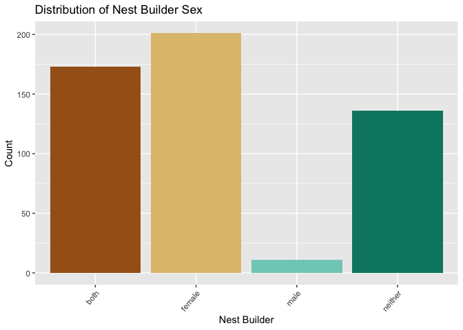<!-- -->
We see that the most common nest builder is female, followed by both parents, then neither, and the least common (which is very uncommon) is a male nest builder.

Who are the male nest builders?

```r
dataset %>% 
  select(species, nest_builder) %>% 
  filter(nest_builder == "male")
```

```
## # A tibble: 11 × 2
##    species                 nest_builder
##    <chr>                   <chr>       
##  1 Alectoris_rufa          male        
##  2 Lagonosticta_senegala   male        
##  3 Limicola_falcinellus    male        
##  4 Limosa_limosa           male        
##  5 Numenius_arquata        male        
##  6 Oceanodroma_leucorhoa   male        
##  7 Ploceus_manyar          male        
##  8 Sturnus_vulgaris        male        
##  9 Tringa_nebularia        male        
## 10 Troglodytes_troglodytes male        
## 11 Vanellus_spinosus       male
```

2. Do other factors have correlations with the sex of the nest builder?

Let's look at how nest site and nest builder correlate.


```r
builder_vs_site <- dataset %>% 
  ggplot(aes(x=nest_builder, fill=nest_builder)) + 
  geom_bar() +
  theme(axis.text.x = element_text(angle=50, hjust=1)) +
  labs(title="Nest Builder Sex by Site",
       x="Nest Builder", 
       y="Count",
       fill="Nest_builder") + 
  facet_wrap(~nest_site)

builder_vs_site + scale_fill_brewer(palette="BrBG")
```

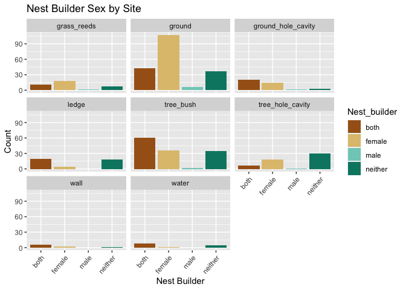<!-- -->
We see that females tend to take the lead in ground and grass reed nest building. Both parents tend to be more involved in ground holes, ledges, tree bushes, walls, and water, while neither may do work in tree holes. 

Here's another way of visualizing the same info:

```r
dataset %>% 
  ggplot(aes(x=nest_site, fill=nest_builder)) +
  geom_bar(position = "dodge") +
  theme(axis.text.x = element_text(angle=50, hjust=1)) +
  labs(title="Nest Site by Sex of Builder",
       x="Site", 
       y="Count",
       fill="Nest Builder") +
  scale_fill_brewer(palette="BrBG")
```

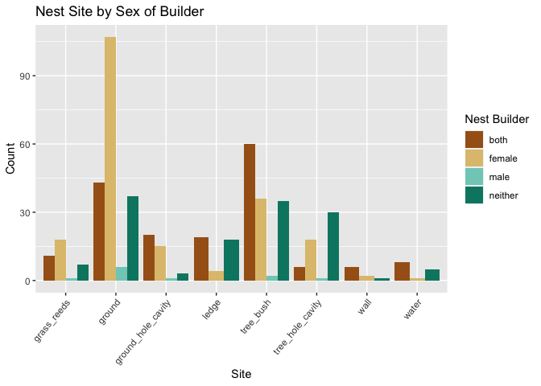<!-- -->

We'll also take a look at how nest structure and nest builder correlate.

```r
builder_vs_type <- dataset %>% 
  filter(nest_builder != "neither") %>% 
  ggplot(aes(x=nest_builder, fill=nest_builder)) + 
  geom_bar(color="black") +
  theme(axis.text.x = element_text(angle=50, hjust=1)) +
  labs(title="Nest Builder Sex by Nest Structure",
       x=NULL, 
       y="Count",
       fill="Nest Builder") + 
  facet_wrap(~nest_structure)

builder_vs_type + scale_fill_brewer(palette="BrBG")
```

<!-- -->

Alternatively:

```r
dataset %>% 
  filter(nest_builder != "neither") %>% 
  ggplot(aes(x=nest_structure, fill=nest_builder)) +
  geom_bar(position = "dodge", color="black") +
  theme(axis.text.x = element_text(angle=50, hjust=1)) +
  labs(title="Nest Structure by Builder Sex",
       x="Site", 
       y="Count",
       fill="Nest Builder") +
  scale_fill_brewer(palette="BrBG")
```

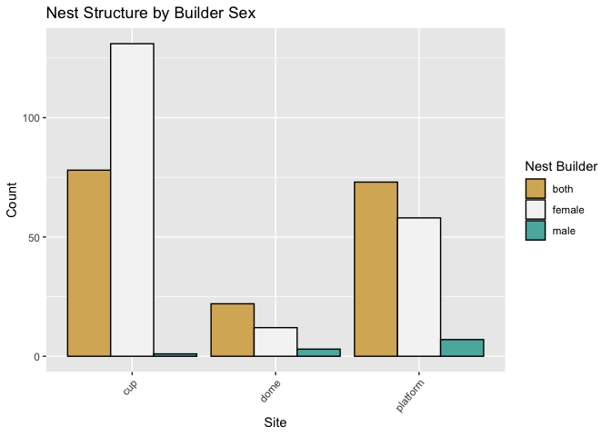<!-- -->

3. How does the sex of the nest builder correlate with our continuous variables?

Nest builder and mean clutch size:

```r
dataset %>% 
  filter(nest_builder != "neither") %>%
  filter(clutch_size_mean != "NA") %>% 
  ggplot(aes(x=nest_builder, y=clutch_size_mean, 
             fill=nest_builder)) +
  geom_boxplot() +
  labs(title="Mean Clutch Size by Builder Sex",
       x=NULL, 
       y="Mean Clutch Size",
       fill="Nest Builder") +
  scale_fill_brewer(palette="BrBG")
```

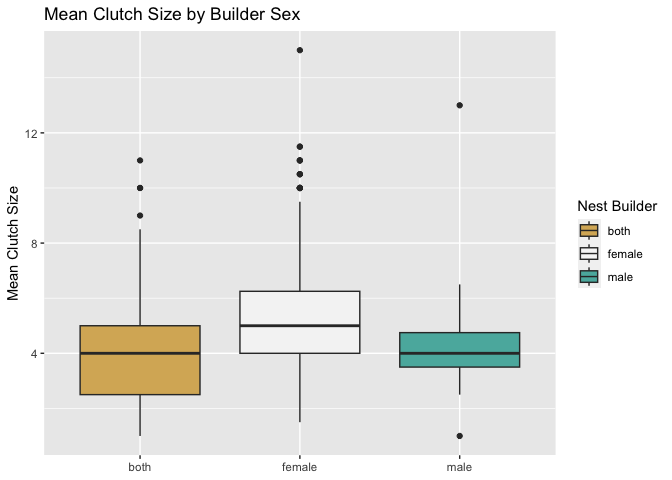<!-- -->

4. incubating_sex... nest builder

```r
na.omit(dataset) %>%
ggplot(aes(x = latitude_mean, y = clutch_size_mean)) +
  geom_density_2d() +
  labs(x = "Latitude (Mean)", y = "Clutch Size (Mean)")
```

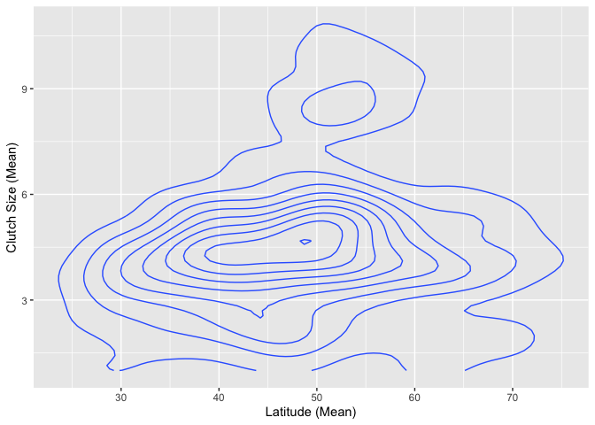<!-- -->
--- 

4. lets see how clutch sizes is related to latitude and whether nest types are related to that. 


```r
na.omit(dataset) %>%
   filter(nest_builder != "neither") %>%
ggplot( aes(x = latitude_mean, y = clutch_size_mean, color = nest_structure)) +
  geom_point() +
  geom_smooth(method = "lm", se = FALSE, aes(group = nest_structure)) + # Grouping for separate regression lines
  labs(x = "Latitude Mean", y = "Mean Clutch Size", title = "Clutch Size vs. Latitude by Nest Structure") +
  theme_minimal() +
  scale_color_manual(values = c("cup" = "blue", "platform" = "red", "dome"="green", "no nest"="purple")) # Adjust keys and colors
```

```
## `geom_smooth()` using formula = 'y ~ x'
```

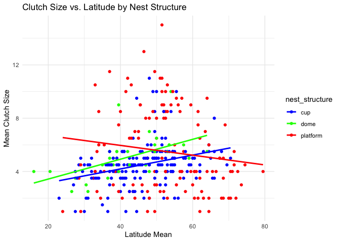<!-- -->

5. Analyze clutch size mean by latitude mean while considering the sex-based role in nest building


```r
na.omit(dataset) %>%
   filter(nest_builder != "neither") %>%
ggplot( aes(x=as.factor(nest_builder), y=clutch_size_mean)) +
  geom_boxplot() +
  facet_wrap(~nest_builder) +
  labs(title="Clutch Size by Nest Builder", x="Nest Builder", y="Clutch Size Mean")
```

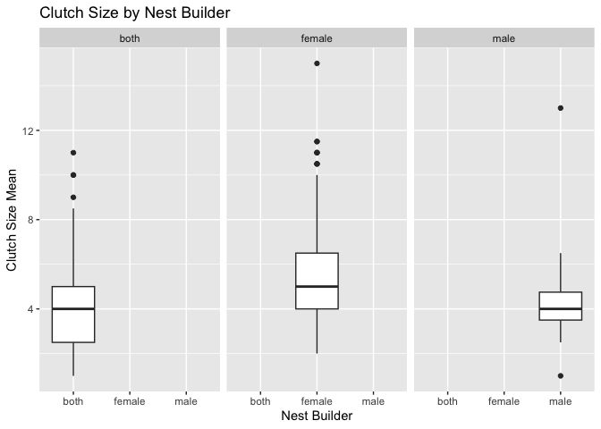<!-- -->

5. Now, we want to explore to see if different latitudes have any effects on breeding season


```r
na.omit(dataset) %>%
   filter(nest_builder != "neither") %>%
ggplot( aes(x = latitude_mean, y = length_breeding)) +
  geom_point() +  
  geom_smooth(method = "loess", color = "blue") +  
  labs(title = "Breeding Season Length Across Latitudes",
       x = "Latitude Mean",
       y = "Breeding Season Length") +
  theme_minimal()
```

```
## `geom_smooth()` using formula = 'y ~ x'
```

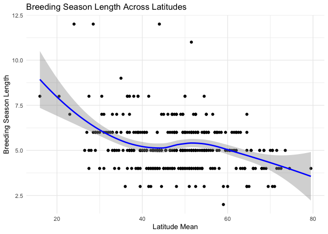<!-- -->
6. Now, lets see nest structure distribution


```r
na.omit(dataset) %>%
   filter(nest_builder != "neither") %>%
ggplot( aes(x = nest_structure)) +
  geom_bar(aes(fill = nest_structure), show.legend = FALSE) +
  labs(title = "Nest Structure Distribution", x = "Nest Structure", y = "Count") +
  theme_minimal()
```

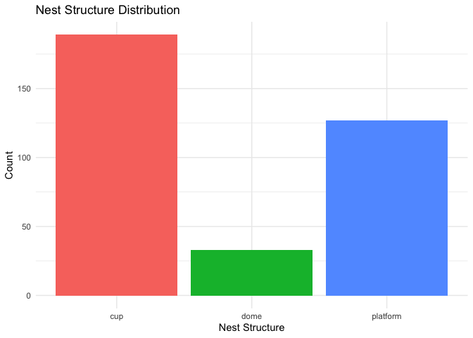<!-- -->
7. Let's see if different sexes have a preference in the type of nest they build


```r
na.omit(dataset) %>%
   filter(nest_builder != "neither") %>%
ggplot( aes(x = nest_structure, fill = nest_builder)) +
  geom_bar(position = "dodge") +
  labs(title = "Nest Structure Distribution by Sex", x = "Nest Structure", y = "Count") +
  theme_minimal()
```

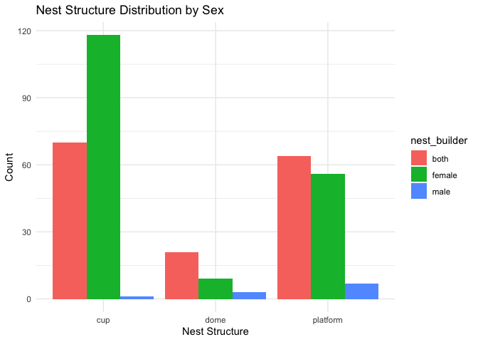<!-- -->

7. Let's check whether clutch size has anything to do with the sex of the parent that builds the nest. That tells us about the fitness


```r
na.omit(dataset) %>%
   filter(nest_builder != "neither") %>%
ggplot( aes(x = nest_builder, y = clutch_size_mean, fill = nest_builder)) +
  geom_boxplot() +
  labs(title = "Clutch Size by Nest Builder Sex", x = "Nest Builder Sex", y = "Mean Clutch Size") +
  theme_minimal()
```

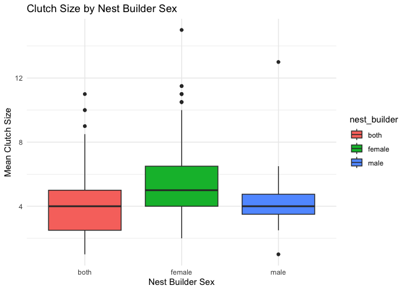<!-- -->
8. breeding season length by latitude

```r
na.omit(dataset) %>%
   filter(nest_builder != "neither") %>%
ggplot( aes(x = nest_builder, y = length_breeding, fill = nest_builder)) +
  geom_boxplot() +
  theme_minimal() +
  labs(title = "Breeding Season Length by Nest Builder",
       x = "Nest Builder",
       y = "Breeding Season Length (months)") +
  scale_fill_brewer(palette = "Set1")
```

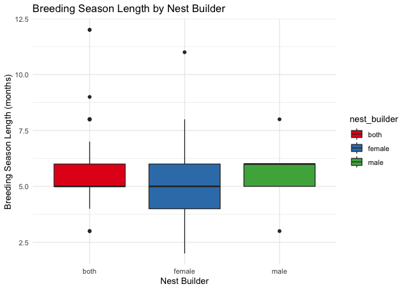<!-- -->
9. The study checked:"species in which females lay larger clutch sizes and incubate eggs alone are more likely to have nests built by females alone"


```r
na.omit(dataset) %>%
 ggplot(aes(x = clutch_size_mean)) +
  geom_histogram(aes(fill = incubating_sex), bins = 30, alpha = 0.6, position = "identity") +
  facet_wrap(~nest_builder) +
  labs(title = "Distribution of Clutch Size Mean by Incubating Sex and Nest Builder",
       x = "Clutch Size Mean",
       y = "Frequency") +
  scale_fill_brewer(palette = "Set1") +
  theme_minimal()
```

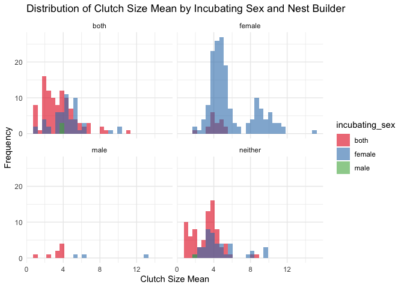<!-- -->
10. The study also checked whether: " sex-specific nest building contributions were predictably related to nest site and structure, as species in which females built nests alone were more likely to have open cup nests relative to enclosed, domed nests of species in which both parents build."


```r
na.omit(dataset) %>%
  filter(nest_structure %in% c('cup', 'dome')) %>%
  ggplot(aes(x = nest_builder, fill = nest_structure)) +
  geom_bar(position = "dodge") +
  scale_y_continuous(labels = scales::percent_format()) +
  labs(title = "Nest Structure by Builder Contribution",
       x = "Nest Builder",
       y = "Percentage of Nest Types",
       fill = "Nest Structure") +
  theme_minimal() +
  scale_fill_brewer(palette = "Set2")
```

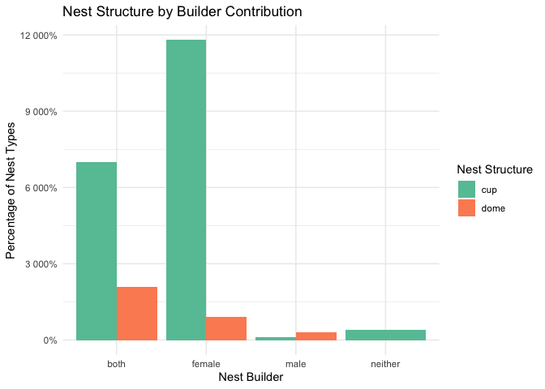<!-- -->


_The code/plots for the other continuous variables would be similar._
